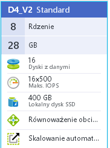

## Przemysław Tomasik, ptomasik@sigma.ug.edu.pl

Rozwiązania zadań z przedmiotu *Bazy NoSQL*:

1. [Zaliczenie](zaliczenie.md):
 - [x] EDA
 - [x] geoJSON
1. [Egzamin](egzamin.md)
 - [x] Aggregation Pipeline

Informacje o komputerze na którym były wykonywane obliczenia:

Obliczenia wykonywane byly na maszynie wirtualnej w chmurze Azure:

| Rodzaj komponentu     | Komponent                       |
|-----------------------|---------------------------------|
| System operacyjny     | Linux Ubuntu Server 15.04 (64-bitowy)  |
| Procesor              | 2.4 GHz Intel Xeon® E5-2673 v3 (Haswell)   |
| Ilość rdzeni          | 8                              |
| Pamięć                | 28 GB                          |
| Dysk| HDD|
| Maks. IOPS | 16x500 |

