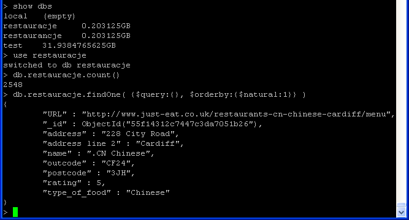

## Egzamin, Przemyslaw Tomasik

Pobralem baze danych brytyjskich restauracji i zaimportowalem standardowo (tym razem bez rozpakowywania do bazy danych):

```sh
time mongoimport -d restaurancje -c restauracje < restaurants.json
```
Proces skonczyl sie szybko:

```sh
connected to: 127.0.0.1
2016-01-28T13:35:59.829+0000 check 9 2548
2016-01-28T13:35:59.829+0000 imported 2548 objects

real    0m1.346s
user    0m0.133s
sys     0m0.042s

```

Sprawdzmy, czy dziala. Wyswietlam pierwszy rekord, licze rekordy itp:



Wyswietle najpierw restauracje w miastach, ktorych nazwa zaczyna sie na "L".

```sh
db.restauracje.find({"address line 2": /^L/}, {_id: 0, name: 1, rating: 1, type_of_food: 1, "address line 2": 1}).sort({name: 1}).limit(5)

{ "address line 2" : "London", "name" : "042 Restaurant & Bar", "rating" : 3, "type_of_food" : "African" }
{ "address line 2" : "London", "name" : "042 Restaurant & Bar", "rating" : 3, "type_of_food" : "African" }
{ "address line 2" : "London", "name" : "042 Restaurant & Bar", "rating" : 3, "type_of_food" : "African" }
{ "address line 2" : "London", "name" : "109 Ristorante", "rating" : 5, "type_of_food" : "Pizza" }
{ "address line 2" : "Leeds", "name" : "1pizza1", "rating" : 4, "type_of_food" : "Pizza" }
```
Sprawdzmy zatem jeszcze 5 afrykanskich restauracji:

```sh
> db.restauracje.find({type_of_food: "African"},{_id: 0}).limit(5)
{ "URL" : "http://www.just-eat.co.uk/restaurants-042-restaurant-e11/menu", "address" : "885 High Road Leytonstone", "address line 2" : "London", "name" : "042 Restaurant & Bar", "outcode" : "E11", "postcode" : "1HR", "rating" : 3, "type_of_food" : "African" }
{ "URL" : "http://www.just-eat.co.uk/restaurants-042-restaurant-e11/menu", "address" : "885 High Road Leytonstone", "address line 2" : "London", "name" : "042 Restaurant & Bar", "outcode" : "E11", "postcode" : "1HR", "rating" : 3, "type_of_food" : "African" }
{ "URL" : "http://www.just-eat.co.uk/restaurants-042-restaurant-e11/menu", "address" : "885 High Road Leytonstone", "address line 2" : "London", "name" : "042 Restaurant & Bar", "outcode" : "E11", "postcode" : "1HR", "rating" : 3, "type_of_food" : "African" }
{ "URL" : "http://www.just-eat.co.uk/restaurants-280degreesafrican-nw6/menu", "address" : "280 Kilburn High Road", "address line 2" : "London", "name" : "280 Degrees African & Nigerian Restaurant", "outcode" : "NW6", "postcode" : "2BY", "rating" : 2.5, "type_of_food" : "African" }
{ "URL" : "http://www.just-eat.co.uk/restaurants-280degreesafrican-nw6/menu", "address" : "280 Kilburn High Road", "address line 2" : "London", "name" : "280 Degrees African & Nigerian Restaurant", "outcode" : "NW6", "postcode" : "2BY", "rating" : 2.5, "type_of_food" : "African" }

```

Sprawdzmy w ogole jakie sa typy jedzenia w restauracjach:

```sh
> db.restauracje.distinct("type_of_food").sort()
[
        "*NEW*",
        "Afghan",
        "African",
        "American",
        "Arabic",
        "Azerbaijan",
        "Bagels",
        "Bangladeshi",
        "Breakfast",
        "Burgers",
        "Cakes",
        "Caribbean",
        "Chicken",
        "Chinese",
        "Curry",
        "Desserts",
        "English",
        "Ethiopian",
        "Fish & Chips",
        "Greek",
        "Grill",
        "Healthy",
        "Ice Cream",
        "Japanese",
        "Kebab",
        "Korean",
        "Lebanese",
        "Mediterranean",
        "Mexican",
        "Middle Eastern",
        "Milkshakes",
        "Moroccan",
        "Nigerian",
        "Pakistani",
        "Pasta",
        "Peri Peri",
        "Persian",
        "Pick n Mix",
        "Pizza",
        "Polish",
        "Portuguese",
        "Punjabi",
        "Russian",
        "Sandwiches",
        "South Curry",
        "Spanish",
        "Sri-lankan",
        "Sushi",
        "Thai",
        "Turkish",
        "Vegetarian",
        "Vietnamese"
]
```

Czy sa kebaby w Londynie? Sprawdzmy
```sh
db.restauracje.find({"address line 2": "London", "type_of_food": "Kebab"}, {_id: 0, name: 1, rating: 1, type_of_food: 1, "address line 2": 1}).sort({name: 1})
{ "address line 2" : "London", "name" : "Alanya Steak & Kebab House", "rating" : 5, "type_of_food" : "Kebab" }
{ "address line 2" : "London", "name" : "Ali Baba Kebab House", "rating" : 4.5, "type_of_food" : "Kebab" }
{ "address line 2" : "London", "name" : "Ali Baba Kebab House", "rating" : 4.5, "type_of_food" : "Kebab" }
{ "address line 2" : "London", "name" : "Angel Kebab", "rating" : 5, "type_of_food" : "Kebab" }
{ "address line 2" : "London", "name" : "Angel Kebab", "rating" : 5, "type_of_food" : "Kebab" }
{ "address line 2" : "London", "name" : "Askew Fish & Kebabs", "rating" : 5.5, "type_of_food" : "Kebab" }
{ "address line 2" : "London", "name" : "Atlantic BBQ Grill", "rating" : 4, "type_of_food" : "Kebab" }
{ "address line 2" : "London", "name" : "Best Kebab", "rating" : 3.5, "type_of_food" : "Kebab" }
{ "address line 2" : "London", "name" : "Best Kebab", "rating" : 3.5, "type_of_food" : "Kebab" }
{ "address line 2" : "London", "name" : "Best Kebab", "rating" : 3.5, "type_of_food" : "Kebab" }
{ "address line 2" : "London", "name" : "Best Kebab", "rating" : 3.5, "type_of_food" : "Kebab" }
{ "address line 2" : "London", "name" : "Best Kebab", "rating" : 4.5, "type_of_food" : "Kebab" }
{ "address line 2" : "London", "name" : "Best Kebab", "rating" : 4.5, "type_of_food" : "Kebab" }
{ "address line 2" : "London", "name" : "Best Kebab", "rating" : 5, "type_of_food" : "Kebab" }
{ "address line 2" : "London", "name" : "Best Kebab", "rating" : 5, "type_of_food" : "Kebab" }
{ "address line 2" : "London", "name" : "Best Kebab", "rating" : 5, "type_of_food" : "Kebab" }
```

###Troche Javy

Sprawdzmy najslabiej oceniane restauracje:
```sh
db.restauracje.aggregate([
...       {$group:{_id:"$name",avgRating:
...             {$avg: "$rating"}}},
...         {$sort:{avgRating:1}}])
{ "_id" : "Blaka Jacks - Collection Only", "avgRating" : 0 }
{ "_id" : "Benvenuti - Collection Only", "avgRating" : 0 }
{ "_id" : "Benny's Chicken", "avgRating" : 0 }
{ "_id" : "Bean Cafe", "avgRating" : 0 }
{ "_id" : "Bibble Milkshake Bar", "avgRating" : 0 }
{ "_id" : "Barry's Bar - Collection Only", "avgRating" : 0 }
{ "_id" : "Atlantic Fish Bar - Collection Only", "avgRating" : 0 }
{ "_id" : "Bake Oven Bakery - Collection Only", "avgRating" : 0 }
{ "_id" : "Babu's Indian Spice", "avgRating" : 0 }
{ "_id" : "Alcatraz Caffe Poole", "avgRating" : 0 }
{ "_id" : "Balti Pickles", "avgRating" : 0 }
{ "_id" : "Arowana", "avgRating" : 0 }
{ "_id" : "Big Daddy House", "avgRating" : 0 }
{ "_id" : "Atlantic Bakeries", "avgRating" : 0 }
{ "_id" : "Asia Tandoori Restaurant - Collection Only", "avgRating" : 0 }
{ "_id" : "Alasia", "avgRating" : 0 }
{ "_id" : "Au Village - Collection Only", "avgRating" : 0 }
{ "_id" : "Bear's Boutique Bowling - Collection Only", "avgRating" : 0 }
{ "_id" : "Anokha Indian Bar & Restaurant", "avgRating" : 0 }
{ "_id" : "4550 Miles From Delhi - Collection Only", "avgRating" : 0 }
```
Nic ciekawego, najnizej same zera. Sprawdzmy moze zatem ile jest restauracji w roznych miastach:

```sh
db.restauracje.aggregate(
[
  {"$group" :
    {"_id" : "$address line 2", "count" : {"$sum" : 1}}},
    {"$sort" : {"count" : -1}},
    {"$limit" : 10}
    ])
{ "_id" : "London", "count" : 345 }
{ "_id" : "Birmingham", "count" : 85 }
{ "_id" : "Manchester", "count" : 58 }
{ "_id" : "Glasgow", "count" : 55 }
{ "_id" : "Essex", "count" : 40 }
{ "_id" : "Sheffield", "count" : 37 }
{ "_id" : "Leeds", "count" : 33 }
{ "_id" : "Liverpool", "count" : 32 }
{ "_id" : "Bradford", "count" : 30 }
{ "_id" : "Bristol", "count" : 30 }

```
O, 10 miast z najwieksza iloscia restaucji. Mozna przedstawic to na wykresie!

Najpierw wrzućmy to do pliku excel, tak wyglada tabelka:
| miasto|ilosc|
|----|-----|
|	London	|	345	|
|	Birmingham	|	85	|
|	Manchester	|	58	|
|	Glasgow	|	55	|
|	Essex	|	40	|
|	Sheffield	|	37	|
|	Leeds	|	33	|
|	Liverpool	|	32	|
|	Bradford	|	30	|
|	Bristol	|	30	|


