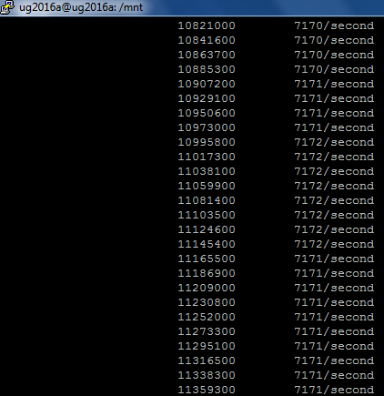
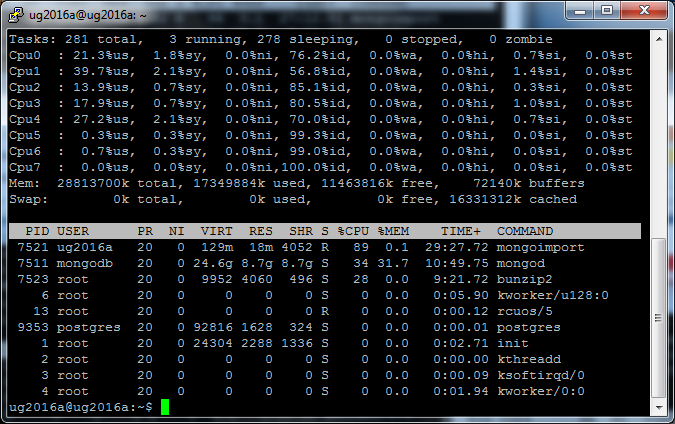
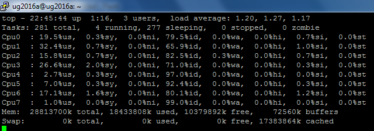
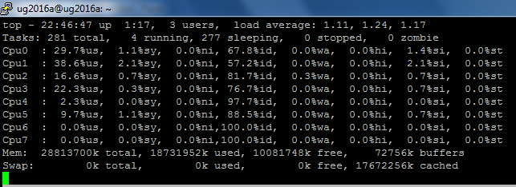
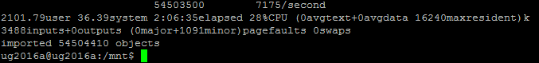
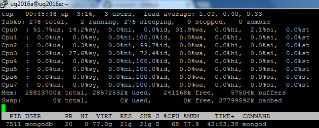

###Zadanie MongoDB

Do zadania wybralem miesieczna baze danych z postow reddita z kwietnia 2015
Nazwa pliku: RC_2015-01

#####Najpierw musialem zmienic domyslny katalog dla bazy mongoDB, gdyz wirtualne maszyny chmury Microsoft maja male dyski zamontowane pod rootem /
Dodalem symboliczy link:

```sh
sudo service mongodb stop
sudo mv mongodb /mnt/mongodb/
sudo ln -s /mnt/mongodb/ /var/lib/mongodb
sudo chown mongodb:mongodb /mnt/mongodb/
sudo service mongodb start
```

#####Import pliku bazy danych Reddit RC_2015-01 do bazy MongoDB wersja 3.0.7


```sh
time bunzip2 -c RC_2015-05.bz2 | mongoimport --drop --host 127.0.0.1 -d test -c reddit
```
Sredni czas importu to ok 7000 pozycji na sekunde.



Procesor obciazony byl w ~80%. Obciazone byly 4 procesory jednoczesnie, zwykle pierwsze. Niestety dane diagnostyczne zostaly skasowane chmurze i mam tylko zrzuty ekranów komendy top:




Po dwoch godzinach koniec!



Formatowanie wyniku "time" jest takie nieladne, poniewaz uzylem "sudo time <>" zamiast "time sudo <>"


Sprawdzmy baze:
```sh
> show collections
reddit
system.indexes
> db.reddit.count()
54504410
```
Jest ok.
Znajdzmy jeszcze pierwszy wynik:

```sh
> db.reddit.findOne()
{
        "_id" : ObjectId("56a93fdc472bdfe138fecf10"),
        "created_utc" : "1430438400",
        "ups" : 4,
        "subreddit_id" : "t5_378oi",
        "link_id" : "t3_34di91",
        "name" : "t1_cqug90g",
        "score_hidden" : false,
        "author_flair_css_class" : null,
        "author_flair_text" : null,
        "subreddit" : "soccer_jp",
        "id" : "cqug90g",
        "removal_reason" : null,
        "gilded" : 0,
        "downs" : 0,
        "archived" : false,
        "author" : "rx109",
        "score" : 4,
        "retrieved_on" : 1432703079,
        "body" : "くそ\n読みたいが買ったら負けな気がする\n図書館に出ねーかな",
        "distinguished" : null,
        "edited" : false,
        "controversiality" : 0,
        "parent_id" : "t3_34di91"
}
```

Pierwszy wpis i po japonsku. Ciekawe jakie subreddity sa japonskie? Uznaje, ze taki, ktore maja w nazwie "jp"

```sh
> db.reddit.find({subreddit: /jp/}, {_id:0, subreddit:1})
{ "subreddit" : "soccer_jp" }
{ "subreddit" : "science_jp" }
{ "subreddit" : "CreditCard_jp" }
{ "subreddit" : "itmejp" }
{ "subreddit" : "gamemusic_jp" }
{ "subreddit" : "jpop" }
{ "subreddit" : "tvdrama_jp" }
{ "subreddit" : "ksjp" }
{ "subreddit" : "ksjp" }
{ "subreddit" : "ksjp" }
{ "subreddit" : "bjpals" }
{ "subreddit" : "itmejp" }
{ "subreddit" : "gundambreaker2_jp" }
{ "subreddit" : "soccer_jp" }
{ "subreddit" : "itmejp" }
{ "subreddit" : "retrogamejp" }
{ "subreddit" : "soccer_jp" }
{ "subreddit" : "soccer_jp" }
{ "subreddit" : "retrogamejp" }
{ "subreddit" : "retrogamejp" }
has more
```

O, jest więcej. Pominmy zatem pierwsze 30 i pokazmy nastepne 10

```sh
> db.reddit.find({subreddit: /jp/}, {_id:0, subreddit:1}).skip(30).limit(10)

{ "subreddit" : "jp_smahogames" }
{ "subreddit" : "retrogamejp" }
{ "subreddit" : "retrogamejp" }
{ "subreddit" : "CreditCard_jp" }
{ "subreddit" : "itmejp" }
{ "subreddit" : "science_jp" }
{ "subreddit" : "itmejp" }
{ "subreddit" : "ksjp" }
{ "subreddit" : "ksjp" }
{ "subreddit" : "nintendo_jp" }
```

Ciekawe ile pozloconych postow jest w subreddicie "nintendo_jp":

```sh
db.reddit.find({subreddit: "nintendo_jp",gilded: { $gte: 1}}).count()
> 0
```
A ile wszystkich wpisow?

```sh
db.reddit.find({subreddit: "nintendo_jp"}).count()
> 416
```

Sprawdzmy, czy rzeczywiscie nie ma zadnego zlota w tym subreddicie:

```sh
db.reddit.find({subreddit: "nintendo_jp",gilded: { $lte: 1}}).count()
> 416
```

Nie ma! Oznacza to, że nikt nie dal zlota w tym subreddicie i jest on maly.

o i agregacja potwierdzająca wynik:

```sh
db.reddit.aggregate([ 
{$group:{_id: "$subreddit", count:{$sum: gilded}}},
{$sort:{count: -1}},
{$limit: 5}
]);
```

Wyszukiwanie obciazalo znaczaco procesor i generowalo duzo IO na dysku twardym.



###Zadanie Postgres

Instaluje paczke pgfutter, bez ktorej import bylby uciazliwy

```sh
wget -O pgfutter https://github.com/lukasmartinelli/pgfutter/releases/download/v0.3.2/pgfutter_linux_amd64
chmod +x pgfutter
```

Import:

```sh
time sudo ./pgfutter --db postgres --user postgres --pw postgres json RC_2015_05
```
I wynik:

```sh
#real     143m7.485s
#user     175m1.809s
#sys       15m32.174s
```

Uff!
Zliczmy rekordy, czy wszystko jest ok:

```sh
select count(*) from import.rc_2015_05;
54504410
```

Zgadza sie wszystko dziala!

Wioski:

|Polecenie | MongoDB | Postgres|
|---------|---------|----------|
|Instalacja|Bardzo prosta|Bardzo prosta, ale dodatkowo trzeba bylo skonfigurowac uzytkownika postgres|
|Import|Trywialny|Trzeba bylo skorzystac z programow dodatkowy, po wielu probach udalo sie, ciezko|
|Czas importu|126 minut|143 minuty|
|Zliczanie|Od razu|Bardzo dlugo, myslalem juz, ze cos jest nie tak|
|Ogolne wrazenia|Dziala bardzo fajnie, zapytania obciazaja CPU i dysk|Wydaje sie dzialac troche "wolniej"|

###geoJSON

Uzylem bazy danych z losowymi punktami (wygenerowana na stronie http://geojson.io/)

```sh
time sudo mongoimport -d miasta -c miasta < miasta.polski.json
connected to: 127.0.0.1
2016-01-28T12:18:32.844+0000 check 9 4100
2016-01-28T12:18:32.844+0000 imported 4100 objects

real    0m0.435s
user    0m0.093s
sys     0m0.043s
```

Import przebiegl szybko.

Dziala!

```sh
> show dbs
admin   (empty)
local   0.078GB
miasta  0.078GB
test    0.078GB
> use miasta
switched to db miasta
> db.miasta.ensureIndex({loc : "2dsphere"})
{
        "createdCollectionAutomatically" : false,
        "numIndexesBefore" : 1,
        "numIndexesAfter" : 2,
        "ok" : 1
}
> db.miasta.findOne()
{
        "_id" : 798544,
        "name" : "Republic of Poland",
        "country" : "PL",
        "loc" : {
                "type" : "Point",
                "coordinates" : [
                        20,
                        52
                ]
        }
}
```

Lokalizacje znajdujace sie do 10 km od Warszawy:

```sh
> db.miasta.find({loc: {$near: {$geometry: {type: "Point", coordinates: [21.005687713623047,52.23179481161377]}, $maxDistance: 5000}}}).skip(1)
{ "_id" : 764255, "name" : "Muranów", "country" : "PL", "loc" : { "type" : "Point", "coordinates" : [ 20.99021, 52.243679 ] } }
{ "_id" : 858787, "name" : "Województwo Mazowieckie", "country" : "PL", "loc" : { "type" : "Point", "coordinates" : [ 21, 52.25 ] } }
{ "_id" : 6695624, "name" : "Warszawa", "country" : "PL", "loc" : { "type" : "Point", "coordinates" : [ 21.04191, 52.23547 ] } }
{ "_id" : 7531926, "name" : "Warszawa", "country" : "PL", "loc" : { "type" : "Point", "coordinates" : [ 21.061399, 52.233101 ] } }
{ "_id" : 768780, "name" : "Koło", "country" : "PL", "loc" : { "type" : "Point", "coordinates" : [ 20.94903, 52.245739 ] } }
```


